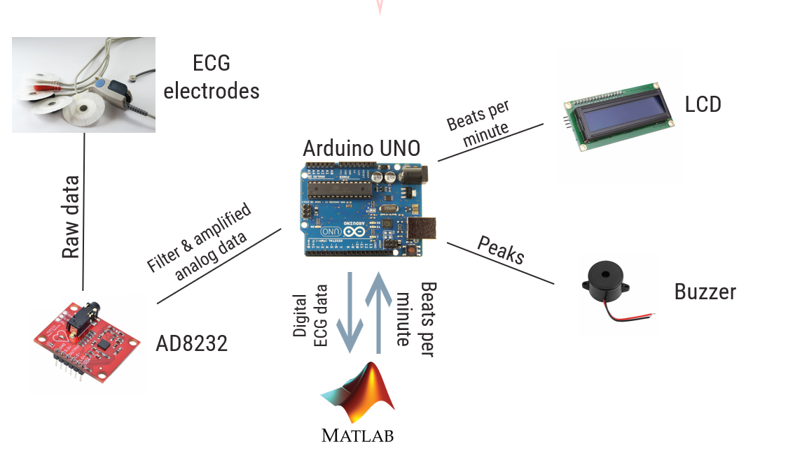

# ECG Human–Computer Interface System

A biomedical **ECG monitoring project** where Arduino + AD8232 acquire raw cardiac signals, Matlab processes and visualizes the ECG in real time, and the Arduino drives an LCD + buzzer for feedback.

## 🎯 Objectives
- Plot a **live electrocardiogram** on PC (Matlab).
- Implement a **beep** at every detected R-peak and when electrodes are removed.
- Process data to calculate **heart rate (BPM)**.
- Display BPM on an **I²C LCD**.

## ⚙️ System Architecture
1. **Electrodes** acquire raw cardiac potential.
2. **AD8232** filters + amplifies, feeds analog ECG into Arduino A0.
3. **Arduino** samples analog ECG, sends serial stream to PC.
4. **Matlab** reads serial data, plots ECG, detects peaks, computes BPM.
5. **Matlab → Arduino**: sends BPM back over serial.
6. **Arduino** updates BPM on LCD and triggers buzzer.

## 📂 Repo Layout
firmware/arduino/ecg_main.ino # Arduino code
software/matlab/ecg_live.m # Matlab script
docs/lab-report.pdf # Lab report (BME 531)
docs/project-slides.pptx # MED DESIGN presentation
hardware/bom.csv # Bill of materials
hardware/notes.md # Wiring & electrode placement notes

## 🔧 Components
- Arduino Uno
- AD8232 ECG front-end
- LCD (I²C)
- Buzzer
- ECG electrodes
- Jumper wires

## 🚀 How to Run
1. Flash `firmware/arduino/ecg_main.ino` to Arduino Uno.
2. Connect AD8232 (OUT → A0, LO+ / LO- → Arduino digital pins).
3. Start Matlab, run `software/matlab/ecg_live.m`:
   - Reads serial data
   - Plots ECG in real-time
   - Detects peaks and computes BPM
   - Sends BPM back via serial
4. Arduino:
   - Updates LCD with BPM
   - Beeps buzzer on each detected R-peak
   - Beeps when electrodes are removed

## 📖 Documentation
- [docs/lab-report.pdf](docs/lab-report.pdf)  
- [docs/project-slides.pptx](docs/project-slides.pptx)

## 📜 License
MIT License – see [LICENSE](LICENSE).
